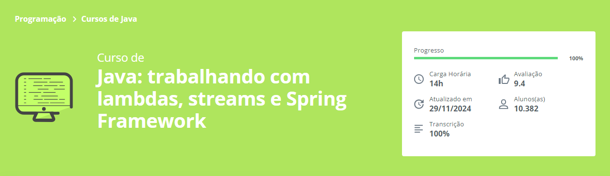

# <! Java: trabalhando com lambdas, streams e Spring Framework/ >

# Desafio: 
<h3>Criar um código que auxilie a busca e comparação entre os valores e anos de carros</h3>

# Ferramentas que utilizei: 

# O que aprendi:

<ul>
    <li>Utilize o Spring Framework em um projeto com linha de comando
    <li>Saiba como trabalhar colaborativamente com Git e GitHub
    <li>Realize a desserialização de dados com a biblioteca Jackson
    <li>Aplique boas práticas de desenvolvimento com funções lambdas
    <li>Manipule fluxo de dados com Streams
    <li>Implemente estatísticas personalizadas
</ul>
